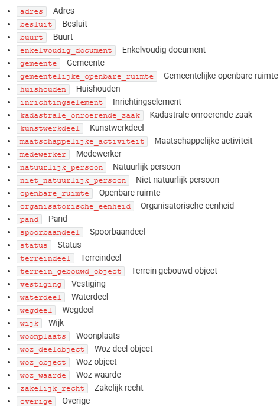

# ZaakObjecten (HeeftBetrekkingOp on ZDS side)
ZaakObjecten is an entity in Zaken API in OpenZaak [Zaken-Api Openapi specs](https://redocly.github.io/redoc/?url=https://raw.githubusercontent.com/vng-Realisatie/zaken-api/1.5.1/src/openapi.yaml). Its representation in ZDS messages is 'heeftBetrekkingOp'.

:::info
    Zaken-Api of OpenZaak side will be called as `ZGW side` in this documentation.
:::

An example of heeftBetrekkingOp element in ZDS messages:
```xml
<heeftBetrekkingOp StUF:entiteittype="ZAKOBJ" StUF:verwerkingssoort="T">
    <gerelateerde>
        <adres StUF:entiteittype="AOA" StUF:verwerkingssoort="T">
            <BG:identificatie>0091200000046730</BG:identificatie>
            <BG:authentiek StUF:metagegeven="true">J</BG:authentiek>
            <BG:wpl.woonplaatsNaam>Sneek</BG:wpl.woonplaatsNaam>
            <BG:gor.openbareRuimteNaam>Marktstraat</BG:gor.openbareRuimteNaam>
            <BG:huisnummer>15</BG:huisnummer>
            <BG:huisletter xsi:nil="true" StUF:noValue="geenWaarde"/>
            <BG:huisnummertoevoeging/>
            <BG:postcode>8601CR</BG:postcode>
        </adres>
    </gerelateerde>
    <omschrijving>zaak object omschrijving</omschrijving>
</heeftBetrekkingOp>
```

An example of a POST request message of zaakobject:
```json
{
    "zaak": "https://zaken-api.vng.cloud/api/v1/zaken/{uuid}",
    "objectType": "adres",
    "objectIdentificatie": {
        "identificatie": "0091200000046730",
        "wplWoonplaatsNaam": "Sneek",
        "gorOpenbareRuimteNaam": "Marktstraat",
        "huisnummer": 15,
        "huisletter": "",
        "huisnummertoevoeging": "",
        "postcode": "8601CR"
    }
}
```

Each ZaakObject in the Zaken API must have an objectType. In ZDS, this objectType is expressed by the name of the first child element inside the `gerelateerde` element of `heeftBetrekkingOp`.

In the example above, the objectType is represented by the `adres` element, meaning the ZaakObject has the objectType `adres`.

There is a list of objectType's mentioned in Zaken-Api specs (see the picture below). Normally, the objectType (so the the name of first child element under gereleteerde) could be any of the ones in this list. However, we have only implemented the objectType 'adres' yet.

List of ObjectTypen of ZaakObjecten:



### The current behaviour of different objectTypen.

1. The objectTypes that have been implemented:
    - `adres`

    The only objectType that has been implemented so far is `adres`. In case the ZDS message has heeftBetrekkingOp message with `adres` element as the first child element of `gereleteerde` element, then a new ZaakObject is created with the objectType `adres`. If the first child element name under heeftBetrekkingOp/gereleteerde in ZDS message is other than `adres`, then no ZaakObject is created in Zaken-Api.

2. The objectTypes that have NOT been implemented but tolerated by ignoring for now:
    - `natuurlijkPersoon` (in ZDS side) / `natuurlijk_persoon` (in ZGW side)
    - `nietNatuurlijkPersoon` (in ZDS side) / `niet_natuurlijk_persoon` (in ZGW side)
    - `organisatorischeEenheid` (in ZDS side) / `organisatorische_eenheid` (in ZGW side)
    - `medewerker` (both ZDS and ZGW sides)
    - `vestiging` (both ZDS and ZGW sides)

    What 'tolerated by ignoring' means is just not giving any error but only a log warning. If the first child element name under heeftBetrekkingOp/gereleteerde in ZDS message is one of these five elements above, then they are ignored and not implemented so no ZaakObject is created. However, no error message is returned either so the flow continues as normal.

3. The objectTypes that have not been implemented but also not allowed:
    - The rest of the objectTypes in the list shared above

    The rest of the objectTypes other than `adres` and the tolerated ones in the second bullet point have not been implemented but also not allowed to have in the ZDS message. This means that in case the name of the first child element under heeftBetrekkingOp/gereleteerde in ZDS message is one of the these objectTypes, then an error returned and no ZaakObject is created and the flow stops. 


### The valid structure of heeftBetrekkingOp element in ZDS message

All the fields under the heeftBetrekkingOp element of ZDS message look optional so some of the fields in the sample heeftBetrekkingOp message above might be absent in the ZDS message. 
However, some of the fields on the ZGW side are mandatory which are:
    - `identificatie` ('identificatie' in ZDS side)
    - `wplWoonplaatsNaam` ('wpl.woonplaatsNaam' in ZDS side)
    - `gorOpenbareRuimteNaam` ('gor.openbareRuimteNaam' in ZDS side)
    - `huisnummer` ('huisletter' in ZDS side)

Therefore, these fields must be provided in the ZDS message. In case any of these four fields is not provided in the ZDS message, an error is returned and the ZaakObject is not created and the flow stops.
